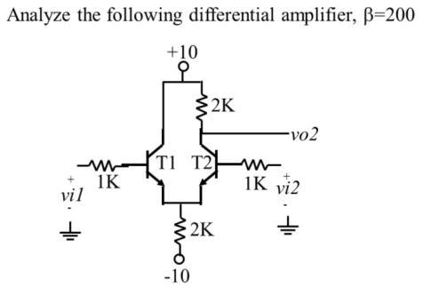

# BJT Designs

Some general designs with their applications.

## Current Mirror / Current Source / Current Sink
{width="250"}

### Basic Application
The collector current on both BJTs is equivalent. As a result, $V_{BE1} = V_{BE2}$.

For Q1:
$$ 
\begin{equation}
I_{REF} = I_E = \dfrac{V_{EE} - 0.7(V)}{R}
\end{equation} 
$$

==Ideal Case:== 
$$
    \begin{equation}
    I_{REF} = I_{s1}exp(\dfrac{V_{BE1}}{V_T})
    \\
    I_{OUT} = I_{s2}exp(\dfrac{V_{BE2}}{V_T})
    \\
    \boxed{\dfrac{I_{OUT}}{I_{REF}} = \dfrac{I_{s2}}{I_{s_2}}} = \dfrac{Area 2}{Area 1}
    \end{equation}
$$
==Non-Ideal (Realistic) Case:== 
$$
    \begin{equation}
    I_{REF} = I_{c1}+\dfrac{2I_{c1}}{\beta} = I_{c1}(1 + \dfrac{2}{\beta{}})
    \\
    I_{OUT} = I_{c1}
    \\
    \boxed{\dfrac{I_{OUT}}{I_{REF}} = \dfrac{1}{1+\dfrac{2}{\beta{}}}}
    \end{equation}
$$

### 

### Examples
#### 1.
{width="350", align=left}

1. Simplfy into functional diagram and add test source (vtest)
    {width="300"}
2. $$r\pi{} = \beta{}(V_T/1mA)$$

## Differential Amplifier
Consisting of at least two BJTs. Generally, a known current, **Ie**, will be the primary consideration for the design. 

The amplifier will amplify the difference signal between Vin1 and Vin2. For instance, given two signals with the same DC offset, but only one has a sinusoidal element, only the sinusoid will be amplified. Vin1 and Vout1 are out of phase. Vin1 and Vout2 are non-inverting. Vout is inverting and Vout1 is non-inverting.

This is the most basic version of the amplifier, there are plenty of variations. The derivations for the specific equations for this amplifier are also included.

{width="350", align=left}
$$ 
\begin{equation}
    I_{c1} = I_{c2} = I_e \\
    \\
    V_{o1} = V_{o2} = V_{cc} - \dfrac{R_cI_e}{2}
\end{equation}
$$

  * Differential Input Voltage:     $\boxed{v_{id} = v_{i1} - v_{i2}}$
  * Common Input Voltage:           $\boxed{v_{ic} = \dfrac{v_{i1} + v_{i2}}{2}}$
  * Differential Output Voltage:    $\boxed{V_{od} = V_{o1} - V_{o2}}$
  * Common Output Voltage:          $\boxed{V_{oc} = \dfrac{V_{o1} + V_{o2}}{2}}$
  * Single Sided Output Voltage:    $\boxed{V_{oss} = V_{o1} = V_{o2}}$
   
Differential Mode Voltage Gain $A_{vd}$
$$
\begin{equation}
    A_{vd} = \dfrac{Vod}{v_{id}} = \dfrac{-\beta{}R_C}{r\pi{}} = -gmR_C
    \\
    V_{o1} = -\beta{} i_{b1} R_C
    \\
    V_{o2} = -\beta{} i_{b2} R_C
    \\
    Vod = V_{o1} - V_{o2} = (\dfrac{\beta{}R_C}{\dfrac{v_{id}}{2} + \dfrac{v_{id}}{2}})
\end{equation}
$$

Common Mode Voltage Gain $A_{vc}$

$$
\begin{equation}
    A_{vc} = \dfrac{V_{oc}}{v_{ic}} = \dfrac{(V_{o1} + V_{o2})/2}{(vin + vin2)/2}
    \\ 
    V_e = 2Re(\beta{}+1)i_b
    \\
    i_b = \dfrac{v_{ic} - Ve}{r\pi{}} = \dfrac{v_{ic}}{2Re(\beta{}+1)+r\pi{}}
    \\
    V_{oc} = \dfrac{-\beta{}i_{b1}Rc + -\beta{}i_{b2}Rc}{2}
    \\
    Avc = \dfrac{V_{oc}}{v_{ic}} = \dfrac{-\beta{}Rc}{2Re(\beta{}+1)+r\pi{}}
\end{equation}
$$

Single Sided Output Differential Voltage Gain:
$$
\begin{equation}
    \boxed{\dfrac{V_{oss}}{v_{id}}=\dfrac{-\beta{}Rc}{2r\pi}}
\end{equation}
$$
Single Sided Output Common Mode Voltage Gain:
$$
\begin{equation}
    \boxed{\dfrac{V_{oss}}{v_{ic}}=\dfrac{-\beta{}Rc}{2Re\pi(\beta{}+1)+r\pi{}}}
\end{equation}
$$
Common Mode Rejection Ratio: $CMRR$ is a figure of merit to compare differential amplifiers
$$
\begin{equation}
    \boxed{CMRR = \dfrac{Avd}{Avd}}
\end{equation}
$$
Differential Mode Input Resistance: $\boxed{Rid = 2r\pi{}}$

Common Mode Input Resistance: 
$$
\begin{equation}
    \boxed{Ric = r\pi{} + (\beta{}+1)2Re}
\end{equation}
$$

### Simple Example
{width="350"}

* DC Analysis: Assuming $V_{in1} = V_{in2} =$ zero, $I_{C1} = I_{C2}$ and $I_{B1} = I_{B2}$
    * KVL:
        * $I_B(1k\Omega{}) + 0.7 + 2(\beta{}+1)I_B(2k\Omega{}) - 10 = 0$
        * $I_B = \dfrac{9.3 (V)}{(1k\Omega{}+2(200+1)2k\Omega{})} = 11.6uA$
        * $I_C = 200I_B = 2.32mA$
        * $V_{CE1} = 10 - -I_B(1k\Omega{})- -0.7 = 10.7$
        * $V_{CE2} = 10 -  I_C(2k\Omega{}) - -0.7 = 6.06$
        * $r\pi{} = \dfrac{\beta{}V_T}{I_C} = \dfrac{200(0.026V)}{2.32mA} = 2.24k{\Omega{}}$
* AC Analysis:
    * $A_{vdss} = \dfrac{gmR_Cr\pi}{2(1k\Omega{}+r\pi)} = \dfrac{\beta{}R_C}{(r\pi{}+1k\Omega{})} = 61.7$
    * $\dfrac{V_{oss}}{V_{ic}} = \dfrac{-\beta{}R_C}{2R_e(\beta{}+1)+(r\pi{}+1k\Omega{})}$
    * $CMMR = {A_{vdss}}/{\dfrac{V_{oss}}{V_{ic}}} = \dfrac{61.7}{0.496} = 125$
  Analog Electronics Lecture -> [Click to Download](pdfs/Analog_Electronics_RIT_EEEE_480.pdf)
  
  Microelectronic Circuits by Dedra & Smith -> Chapter 9

## Common Mode Amplifier

## Cascode Amplifier
* **Pros**:
    * Higher Output Resistance

* **Cons**:
    * The input voltage needs to be great enough to turn on both transistors into the saturation region. $V_1 >= V_{CE_{SAT}}$

### BJT Simple Cascode Amplifier \\
A Common Emitter (CE) stacked with a Common Base (CB).

### MOSFET Simple Cascode Amplifier \\
A Common Source (CS) stacked with a Common Gate (CG).