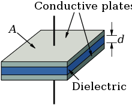
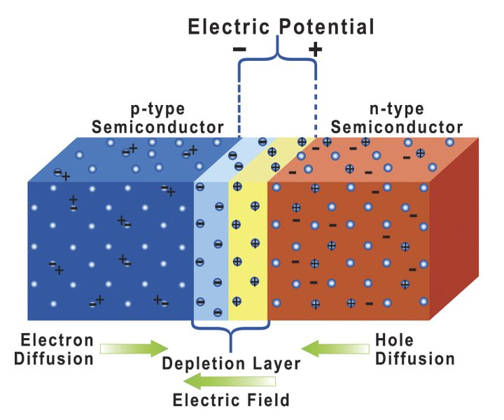

# Circuit Devices
Documentation for all standard components. Specific components that can be generalized with similar characteristics are grouped together. (Ex. Schottky  Diode is with Diodes).

## Resistor

### Overview
The simplest of all electrical components. A resistor is a *passive* two terminal device that applies electrical resistance.

### Component Options
#### Thick Film Resistor
Standard THT resistor commonly found in prototypes around the world. 
```
+ Cheap and Easy to work with
+ Various packages for different amounts of power dissipation
- Low Tolerance, package leads adjust resistance slightly
- Stray Capacitance, package lengths add in line capacitance
``` 
{ width="300" }

#### Potentiometer
Adjustable resistance based either on a physical knob or a digital register. Adjustable between two resistance values. Can be either THT or SMD.

## Capacitor

### Overview
Stores electrical charge in an electric field. 

Two conductive plates are seperated by a dielectric to store charge.  

Capacitance is defined as 
$$
\begin{equation}
    C = \dfrac{Q}{V} = \dfrac{\epsilon{}\cdot{}A}{d}
\end{equation}
$$ 

### Component Options
#### Aluminum Electrolytic Capacitor
#### Ceramic Disk Capacitor
## Inductor

## Diodes

### Overview

A diode is a semiconductor device that allows current to flow in only one way. 

### Theory

A standard **PN diode** is an assembly of two differently *dopped* regions of a material (commonly silicon). 
*Doping* is process of exposing the material to other elements so free electrons are produced. The coefficents of a doped region 
are the amount of valence electrons for a given area.

{width: "400"}

All diodes have a voltage drop across the diode (usually 0.7V). This is because of the differences in doping between the two regions.

The ability for current to flow across the diode is controlled by the **depletion layer**. The movement of this layer determines which of the four possible modes the diode is operating in.

1. Open-Circuit - No external affect on the circuit. Since there is no input, there is no output.
   
2. Forward Bias - External current applied to the anode (negative P terminal). The ==ideal current across the diode== is 
    \begin{equation}
        I_D = I_se^{(-1+\dfrac{V_D}{nV_T})}
    \end{equation}

    * $I_D$ = current throught the diode
    * $I_S$ = saturation current of the diode
    * $V_D$ = voltage drop across the diode (0.7V)
    * $V_T$ = thermal voltage (0.026V at room temperature)
    * $n$ = ideal factor based on fabrication (1 unless defined from manufacturer) 

3. Reverse Bias - External current applied to the cathode (positive N) terminal). This is in the opposite direction that current is supposed to be applied

## MOSFET 
Stands for Metal-Oxide-Semiconductor-Field-Effect transistor

## BJT (Bipolar Junction Transistor)
A current based transistor that is either NPN or PNP where there are two junctions. All BJT's have four different operating modes

1. Saturation - Both junctions forward biased
2. Cutoff - Both Junctions reverse biased
3. Forward Active (Amplifier) - EBJ forward biased, CBJ reversed biased
4. Reverse Active - EBJ reverse biased, CBJ forward biased