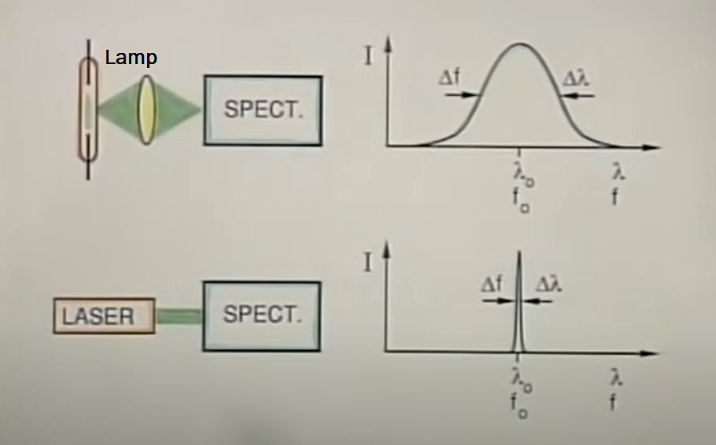

# LASERs 101

These notes are based off of a series called "Laser Fundamentals" produced by Dr. Shaoul Ezekiel and published by MIT OpenCourseWare

* [Laser Fundamentals I](https://www.youtube.com/watch?v=saVE7pMhaxk&list=PLX22u5cw7gIWC1djhphKPBabbReVpTpxU&index=20)
* [Laser Fundamentals II](https://www.youtube.com/watch?v=urbZ8CTceu0)
* [Laser Fundamentals III](https://www.youtube.com/watch?v=_qixt0NLc9I)
* [Laser Fundamentals III - Continued](https://www.youtube.com/watch?v=slNPMzQ4Nhw)

## Part I
### Why are LASERs cool?**

* Fantastic Applications
    - bar code readers
    - compact disks
    - LASER "shows"
    - color copiers
    - sensors
    - military systems
    - non-destructive testing
    - ==fiberoptic communication== << focus of most applications
    - medical procedures

### LASER Properies
1. Visible Range - Able to pick from a wide series of bands
2. Tight Spectrum Width - Precise control of the wavelength of the LASER
   {width: "400"}
3. High Temperal Coherenece
      1. Ended Part 1 @ 12:05:00 in video